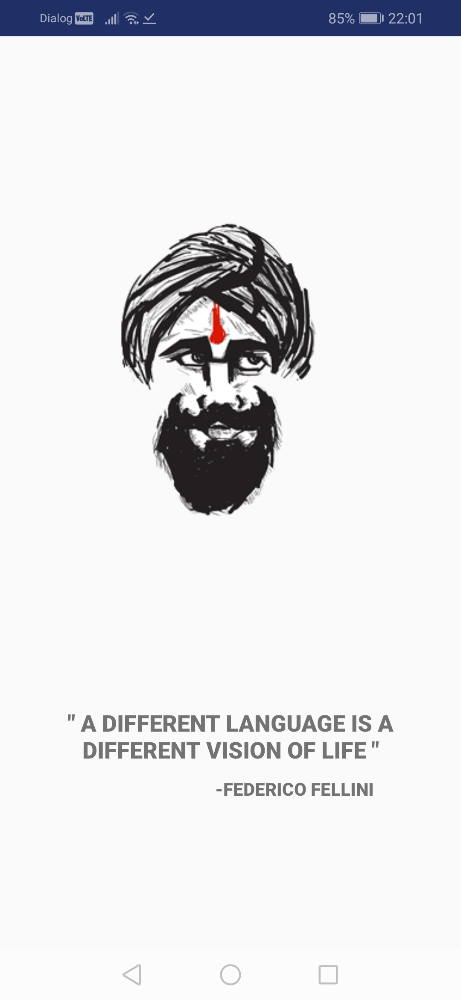
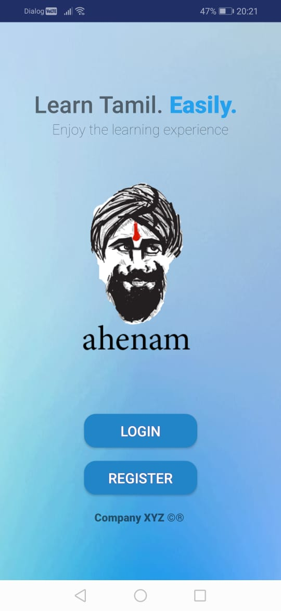
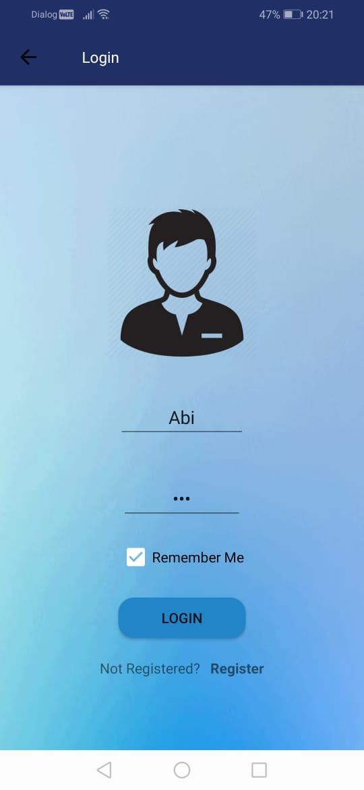
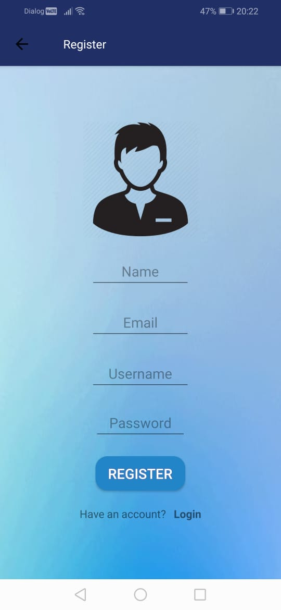
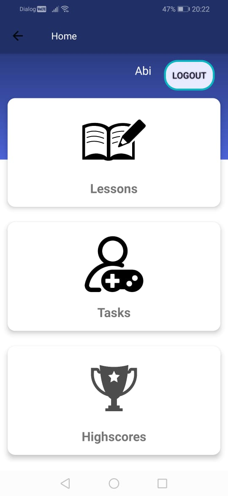
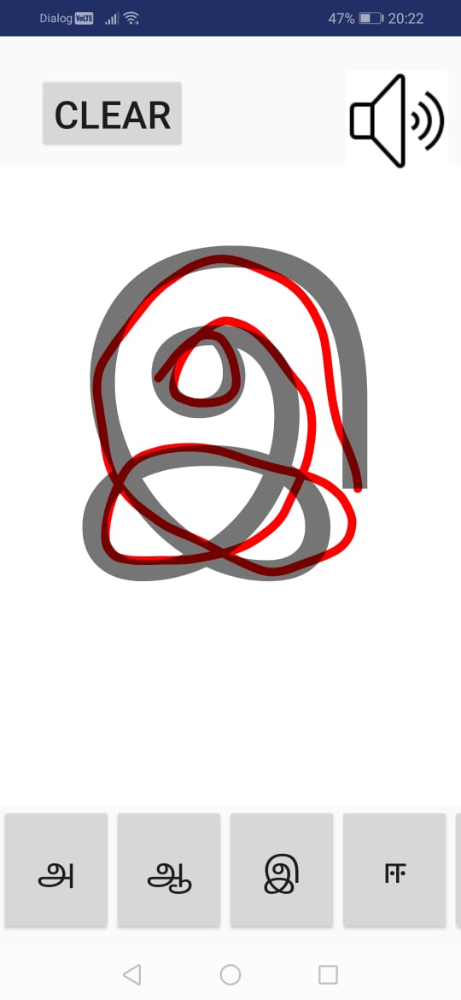
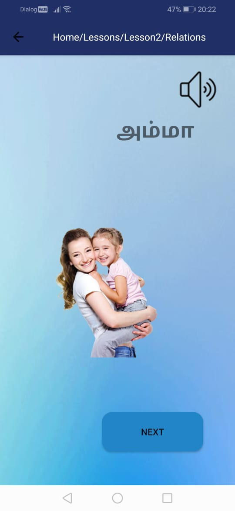
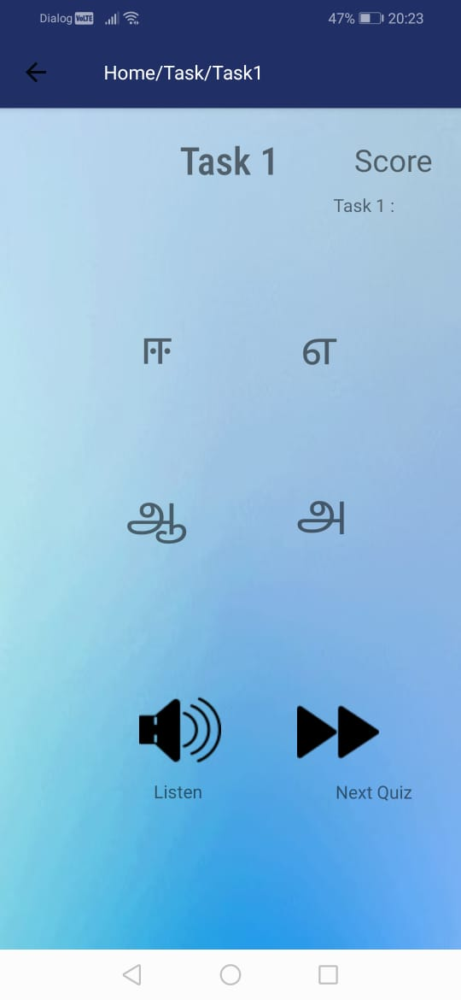
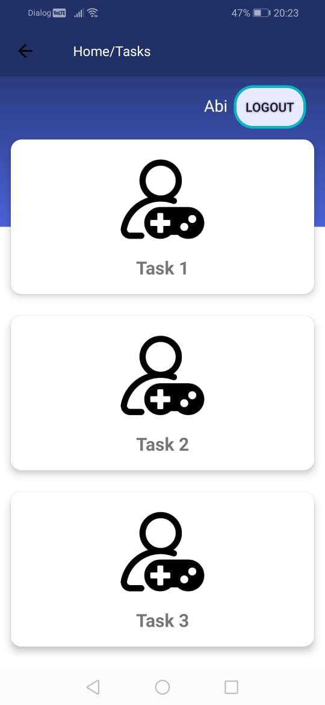
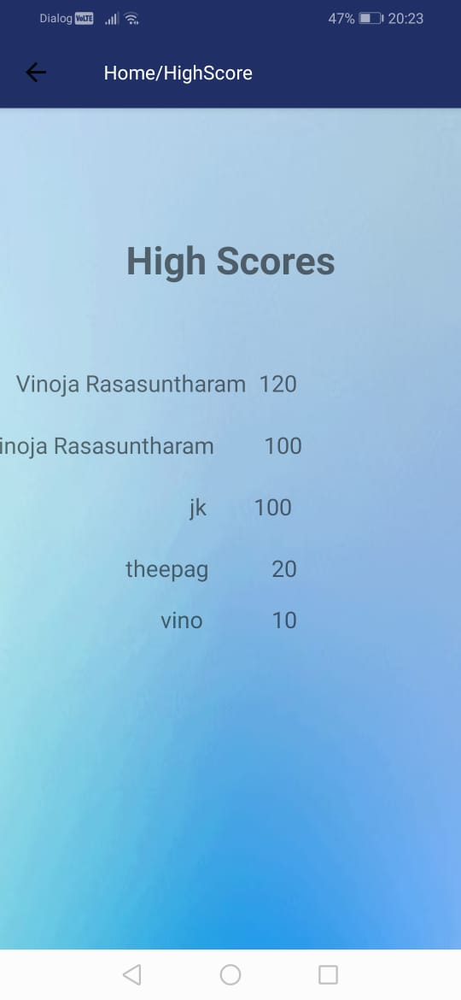

# EasyLearnTamil

A Tamil Language learning Android application

## Splash Screen

## Start Screen

## Login Screen

## Signup Screen

## Home Screen

## Lesson Screens

## Task Screen

## High Score Screen

